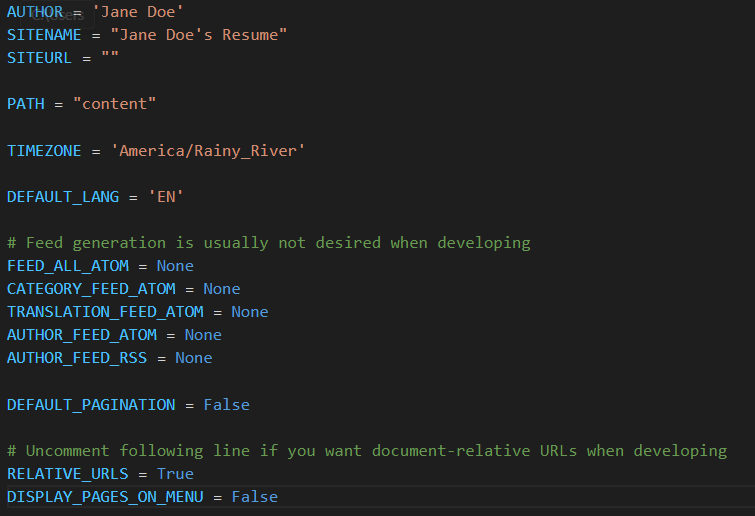
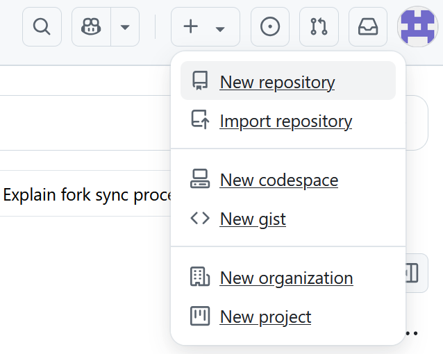
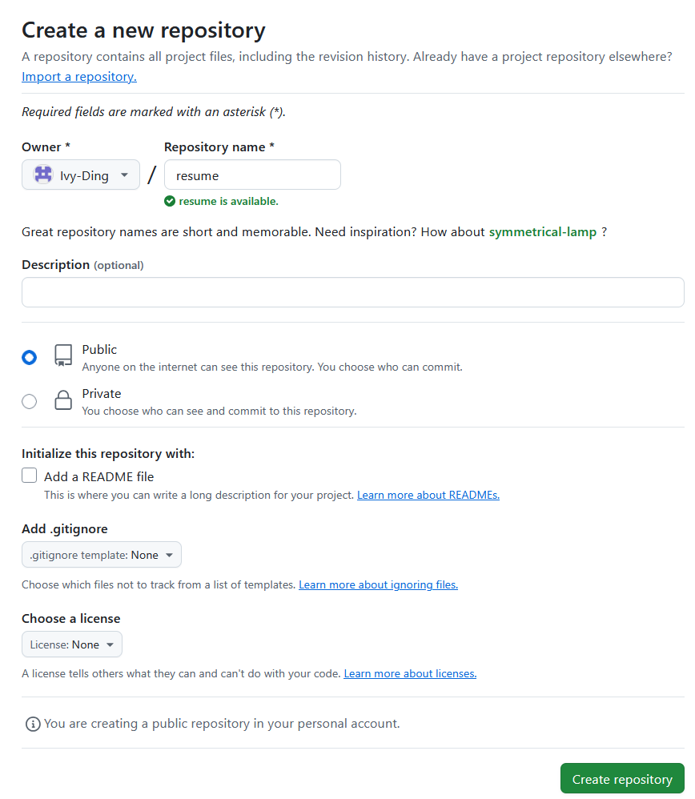
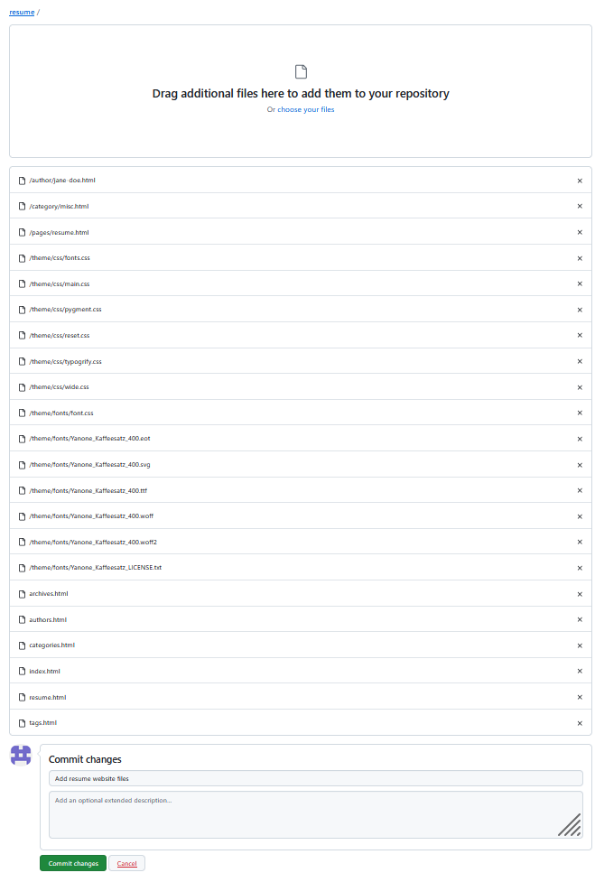
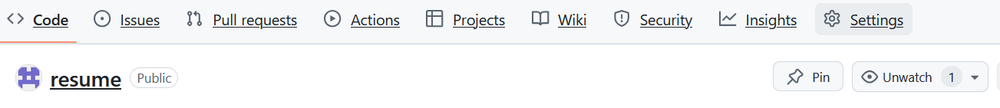
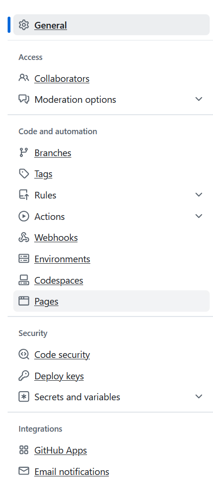
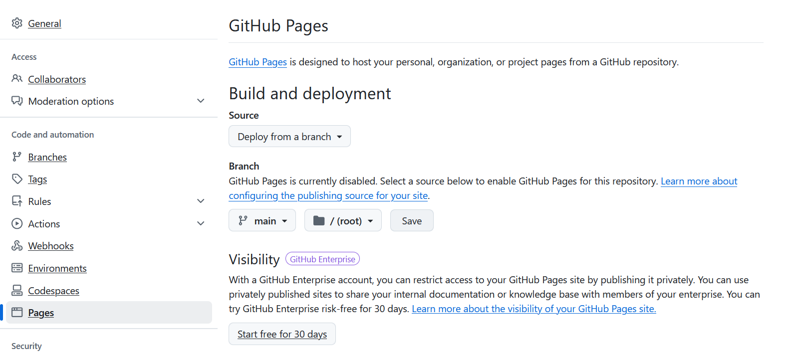

# Hosting A Static Website on GitHub

## Purpose

This README:
- describes the steps of hosting a static resume on GitHub
- describes the steps of using Pelican to generate a static website containing the resume
- describe information, best practices, and recommendations on documentation tools from *Modern Technical Writing* by Andrew Etter

## Prerequisites

You will need:
- a resume in Markdown format
- an email
- a computer/laptop/similar device
- a web browser
- internet access

You should be able to:
- use a operating system 
- interact with websites and softwares (e.g. open websites, create accounts)
- perform simple operations on the command-line (e.g. change directory, run command) 

## Instructions

### Static Site Generation

#### Preparation 
1. Create a folder to hold the source files for the website. This folder will hereon be referred to as the “source folder".
1. Make a resume in regular Markdown format, if none exist already.
1. Edit the resume to add `Title: Your Name` (e.g. "Title: Jane Doe") as the first line of the resume
    1. optional: Edit your resume to add `save_as: index.html` as the second line of the resume. This makes it the home page of the website.
1. Go to pelicanconf.py
1. remove the blog roll links by deleting the section `LINKS = (...)`
1. remove the social links by deleting the section `SOCIAL = (...)`
1. add the line `RELATIVE_URLS = True` to the end of the file
1. add the line `DISPLAY_PAGES_ON_MENU = False` to the end of the file
- note: your `pelicanconf.py` file should look like this: 

#### Pelican Preparation
1. TODO download pelican instructions
1. Open the command prompt window
1. Run `pelican-quickstart`
1. Follow the on-screen prompts

#### Quick-Start Prompts
5. Where do you want to create your new website `the path to the source folder created in step 1` (e.g. "C:\Users\JaneD\source")
1. What will be the title of this website `title of website` (e.g. Jane Doe's Resume)
1. Who will be the author of this website `your name` (e.g. Jane Doe)
1. What will be the default language of this web site? \[English\] `2 character code for the language of your choice`（e.g. "EN" for English"
1. Do you want to specify a URL prefix? e.g., https://example.com   (Y/n) `n`
1. Do you want to enable article pagination? (Y/n) `n`
1. What is your time zone? \[Europe/Rome\] `your time zone's tz identifier` (see [List of Database time zones](https://en.wikipedia.org/wiki/List_of_tz_database_time_zones))
1.  Do you want to generate a tasks.py/Makefile to automate generation and publishing? (Y/n) `n`
1. (note) on success, your source folder will now contain 2 subfolders: "content" and "output"

#### Prepare the resume
1. Go to the source folder created in step 1
1. Go to the content subfolder
1. Create a new subfolder named "pages" under the content folder
1. Put the resume Markdown file in the pages folder
1. Run `pelican content -s pelicanconf.py` on the command line while still in the source folder
1. note: on success, you should see the output `Done: Processed 0 articles, 0 drafts, 0 hidden articles, 1 page, 0 hidden pages and 0 draft pages in <x> seconds.`

#### Preview the generated website
1. Navigate to the source folder on the command line
1. Run `pelican --listen`
1. Go to `127.0.0.1:8000` on your browser
1. note: On success, you should see your resume as a website
1. End the website hosting by pressing `Ctrl-D` on your keyboard

### Hosting Websites on GitHub

#### GitHub Preparation
1. Go to [GitHub Create Account](https://github.com/signup) and follow the instructions to create a GitHub account. 
    - note: You will need to provide an email, a password, and a username. 
    - note: The free plan is sufficient to host a website.
2. Go to [GitHub](https://github.com/) and sign in, if not already signed in.
3. Create a new repository by clicking the `+` button on the top right then selecting "New repository". 
1. Enter the repository name (e.g. "resume")
    - note: it is recommended to use all lowercase
    - note: if your repository name is multiple words long, separate them by dashes (e.g. `one-two-three`)
1. Select "Public", if not already selected
- note: your page should now look like this 
1. Click on the "Create repository" in the bottom right.
- note: your repository url will be in the format of `https:github.com/UserName/repo-name` (e.g. https://github.com/Jane-Doe/resume)

#### Upload the static website to the repository
1. Navigate to the repository on your browser
1. Navigate to the upload screen by adding `/upload` after the repository url (e.g. https://github.com/Jane-Doe/resume/upload)
1. Upload all files in the output folder to the repository
1. Scroll to the bottom
1. Under "Commit Changes", briefly describe the changes you've made (e.g. Add resume website files)
- note: your screen should now look like this 
1. Click on the "Commit changes" button on the bottom left

#### Host the Website
1. Go to repository Settings on the top bar 
1. Select "Pages" on the left sidebar 
1. Under "Build and Deployment>Source", select "Deploy from a branch" 
1. Under "Build and Deployment>Branch", select "main" and "/(root)"
- note: your page should look like this 

## Resources
[Pelican Themes](https://github.com/getpelican/pelican-themes): customize appearance of webpages

[Common Mark](https://commonmark.org/help/): quick Markdown tutorial

[Markdown Guide](https://www.markdownguide.org/): detailed Markdown information

[Hosting Your Website on GitHub - Khan Academy](https://www.khanacademy.org/computing/computer-programming/html-css/web-development-tools/a/hosting-your-website-on-github): detailed guide on hosting websites on GitHub

[Forges - Wikipedia](https://en.wikipedia.org/wiki/Forge_(software))

[Static site generator - Wikipedia](https://en.wikipedia.org/wiki/Static_site_generator)

[Pelican](https://getpelican.com/)

[GitHub](https://github.com/)

[GitHub Version Control](https://github.com/resources/articles/software-development/what-is-version-control)

## FAQ